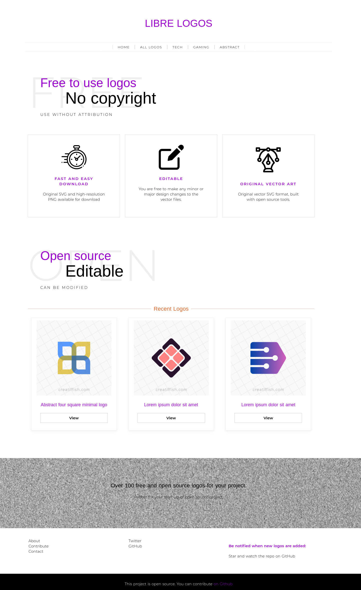

# Libre Logos

Libre Logos is a library of free logos.
The logos are intended for open source projects and NGOs.

Designers are invited to contribute.

**The logo designs are meant to be unique, and there's no intention to steal creative property. If you find a logo that looks too similar to an existing brand, please let me know so that it can be removed**

## Screenshots

## Claiming a logo

### Eligibility
To claim a logo, you must be an active open source project or a registered NGO. "Active" here means:
- Regular commits 
- More than one contributor
- Over 100 GitHub stars
- Git history spanning over 1 year

In addition, your project should be a good fit for the selected logo. Each logo has a short description that specifies the kind of project it is suitable for.

### Process
- To begin claiming a logo, create a GitHub issue, using the ["logo request" issue template](https://github.com/enjeck/libre-logos/issues/new?assignees=&labels=logo+request&template=logo-request.md&title=Logo+request). Please fill the template completely. The more information you provide, the faster your request will be processed.
- Your issue will be reviewed. The "under review" label may be added to the issue.
- If your project is eligible and the requested logo is available, you will be informed that you have claimed the logo. Once the logo is marked as "Claimed" on the [logo list](src/data/logos.js) and `R: Granted` label is added to the issue, the requested logo is officially yours. Congratulations! At this point, all copyright transfers to your project. 

## Contributing

Thank you for your interest! Please check out the [contributing guide](CONTRIBUTING.md).

## License

All logos are licensed under [Creative Commons Zero](LICENSE).

This source code for the website is given the MIT License.
